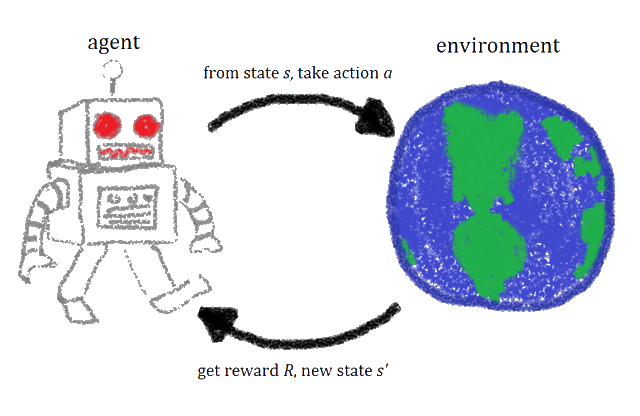

# Awesome List of RL in Real World Resources 

> Great resources for making Reinforcement Learning work in Real Life situations. Papers,projects and more.  

## Description

This list is big compilation of all things trying to adapt Reinforcement Learning techniques in real world.Whether it's mixing real world data into mix or trying to adapt simulations in a better way.It will also include some of Imitation Learning and Meta Learning along the way. If you have anything missing feel free to open a PR , I'm all for community contributions.  

I'm open to new categories so just read the [contributing doc](contributing.md) and provide a pull request.

*You can help also by starring our lovely repository and sharing <3 be safe !* 

## Contents

- [Papers](#papers)
- [Books](#books)
- [Conference Talks](#conference-talks)
- [Education](#education)
- [Simulation to Real with GANs](#simulation-to-real-with-gans)
- [Meta Reinforcement Learning](#meta-reinforcement-learning)
- [Imitation Learning](#imitation)
- [Multi Agent in Real World](#multi-agent-in-real-world)
- [Real World Examples](#real-world-examples)
- [Offline RL](#offline-rl)
- [Datasets](#datasets)
- [Projects](#projects)
- [Libraries](#libraries)
- [Prominent Researchers & Companies to Follow](#prominent-researchers--companies-to-follow)

## Papers

Any academic work done related to RL in real world.This is the other part of list , anything doesn't fit but still related gets here.

- [Domain Randomization for Transferring Deep Neural Networks from Simulation to the Real World](https://arxiv.org/abs/1703.06907)
- [Asymmetric Actor Critic for Image-Based Robot Learning](https://arxiv.org/abs/1710.06542)
- [Towards Learning Robots Which Can Adapt on the Fly](https://arxiv.org/abs/2004.10190)
- [Thinking while moving : Deep RL with Concurrent Control](https://sites.google.com/view/thinkingwhilemoving/home)
- [Towards Vision-Based Deep Reinforcement Learning for Robotic Motion Control](https://arxiv.org/abs/1511.03791)
- [Quantifying the Reality Gap in Robotic Manipulation Tasks](https://arxiv.org/abs/1811.01484)
- [Transferring End-to-End Visuomotor Control from Simulation to Real World for a Multi-Stage Task](https://arxiv.org/abs/1707.02267)
- [Sim-to-Real Robot Learning from Pixels with Progressive Nets](https://arxiv.org/abs/1610.04286)
- [A Practical Approach to Insertion with Variable Socket Position Using Deep Reinforcement Learning](https://arxiv.org/abs/1810.01531)
- [Modelling Generalized Forces with Reinforcement Learning for Sim-to-Real Transfer](https://arxiv.org/abs/1910.09471)
- [Off-Dynamics Reinforcement Learning: Training for Transfer with Domain Classifiers](https://arxiv.org/abs/2006.13916)
- [Emergent Real-World Robotic Skills via Unsupervised Off-Policy Reinforcement Learning](https://arxiv.org/abs/2004.12974)
- [The Ingredients of Real-World Robotic Reinforcement Learning](https://arxiv.org/abs/2004.12570)
- [Learning personalized treatments via IRL](https://arxiv.org/abs/1905.09710)
- [Reinforcement Learning Applications](https://arxiv.org/pdf/1908.06973.pdf)
- [Challenges of Real-World Reinforcement Learning](https://arxiv.org/abs/1904.12901)
- [An empirical investigation of the challenges of real-world reinforcement learning](https://arxiv.org/abs/2003.11881)

## Books

Any book dedicated to RL in real world or book parts that contains related content.

- [Deep RL Hands On 2nd Edition Packt Edition](https://www.packtpub.com/data/deep-reinforcement-learning-hands-on-second-edition)
*Has entire chapter dedicated to real world robotics agent*
- [Foundations of Deep Reinforcement Learning: Theory and Practice in Python](https://www.pearson.com/us/higher-education/program/Graesser-Foundations-of-Deep-Reinforcement-Learning-Theory-and-Practice-in-Python/PGM2027228.html) *Few chapters related to real world applications*

## Conference Talks

Any recorded talk related to subject goes here.

- [GPU Technology Conference 2017: Sim2real collision avoidance for indoor navigation of mobile robots](https://www.youtube.com/watch?v=qFmH4oZPlYY)
- [Reinforcement learning and it's growing role in AI with Real World examples - Microsoft 2020](https://youtu.be/Qahd9poQvLs)
- [RL in Real World 2020 Conference](https://sites.google.com/view/RL4RealLife)
- [RL for Real Life Panel Discussion June 28 2020 ](https://youtu.be/lDdC8Gjat9w)
- [RL for Real Life Panel June 27 2020](https://youtu.be/BB_PHF9hlJg)
- [RL for Health Care Panel Discussion June 28 2020](https://youtu.be/dDSENm2smkQ)
- [Learning to Dock Robustly](https://youtu.be/tlcAqwpxJUQ)
- [On Demand Ride Sharing with RL](https://underline.io/lecture/493-neural-approximate-dynamic-programming-for-on-demand-ride-pooling)
- [BADGR: An Autonomous Self-Supervised Learning-Based Navigation System](https://youtu.be/UtoZEwrDHj4)
- [An empirical investigation of the challenges of real world Reinforcement Learning](https://youtu.be/1d6bD084-hY)

## Education 

Free or paid courses related to subject goes here.

- [Stanford CS330 Meta RL + Multi Task by Chelsea Finn](https://www.youtube.com/watch?v=0rZtSwNOTQo)

## Simulation to Real with GANs

Any paper uses GANs to generate realistic simulation images for adaptation of policy goes here.

- [Using Simulation and Domain Adaptation to Improve Efficiency of Deep Robotic Grasping - GraspGAN](https://arxiv.org/abs/1709.07857)
- [CycleGAN](https://junyanz.github.io/CycleGAN/)
- [RL-CycleGAN: Reinforcement Learning Aware Simulation-To-Real](https://arxiv.org/abs/2006.09001)

## Meta Reinforcement Learning

Anything Meta RL goes here.
- [Meta-Reinforcement Learning for Robotic Industrial Insertion Tasks](https://arxiv.org/abs/2004.14404)
- [Sim-to-Real Transfer of Accurate Grasping with Eye-In-Hand Observations and Continuous Control​](https://research.nvidia.com/sites/default/files/pubs/2017-12_Sim-to-Real-Transfer-of/Sim-to-Real%20Transfer%20of%20Accurate%20Grasping%20with%20Eye-In-Hand%20Observations%20and%20Continuous%20Control.pdf)
- [Meta-Reinforcement Learning Robust to Distributional Shift via Model Identification and Experience Relabeling](https://arxiv.org/abs/2006.07178)

## Imitation Learning

Anything Imitation Learning goes here.

- [Reinforcement and Imitation Learning for Diverse Visuomotor Skills](https://arxiv.org/abs/1802.09564)
- [Learning Agile Robotic Locomotion Skills by Imitating Animals](https://arxiv.org/abs/2004.00784)

## Multi Agent in Real World

Anything Multi Agent Real World RL related goes here.

- [Waiting For it...](nothingyet)

## Real World Examples

Any real world news or projects deployed RL in real life goes here.Mostly news,comments,blog posts etc.

- [Reinforcement learning for the real world - Article](https://www.oreilly.com/radar/reinforcement-learning-for-the-real-world/)

## Offline RL

Anything Offline Reinforcement Learning goes here.

- [Scaling data-driven robotics with reward sketching and batch reinforcement learning](https://arxiv.org/abs/1909.12200)
- [Accelerating Online Reinforcement Learning with Offline Datasets](https://arxiv.org/abs/2006.09359)
- [MOPO: Model-based Offline Policy Optimization](https://arxiv.org/abs/2005.13239)
- [Offline Reinforcement Learning: Tutorial, Review, and Perspectives on Open Problems](https://arxiv.org/abs/2005.01643)

## Datasets 

Saved datasets goes here . Real World data or Simulation data doesn't matter. As long as it has good old (state,action,new_state,reward) tuple.

- [RoboNet - Large Scale Multi Robot Learning](https://arxiv.org/pdf/1910.11215.pdf)
- [GQ-CNN Training Datasets](https://berkeley.app.box.com/s/6mnb2bzi5zfa7qpwyn7uq5atb7vbztng)
- [GQ-CNN Object Mesh Datasets](https://berkeley.app.box.com/s/w6bmvvkp399xtjpgskwq1cytkndmm7cn)
- [HDF5 Database of 3D Objects, Parallel-Jaw Grasps for YuMi, and Robustness Metrics](https://berkeley.app.box.com/s/eaq37px77jxktr8ggti016pr3gpudp9l)
- [Google Robotics Dataset](https://sites.google.com/site/brainrobotdata/home/)*Includes Grasping-Push-Depth Image-Pouring-3DModels*
- [D4RL: Datasets for Deep Data-Driven Reinforcement Learning](https://arxiv.org/abs/2004.07219)

## Projects

Any project link available on internet related to it goes here.

- [Dexterity Network - Grasp Quality Convolutional Neural Networks (GQ-CNN)](https://berkeleyautomation.github.io/dex-net/)

## Libraries

Open source libraries related goes to here.

- [State Representation Learning Zoo](https://github.com/araffin/srl-zoo)
- [Robotics Reinforcement Learning](https://github.com/araffin/robotics-rl-srl)
- [RL Bench](https://github.com/stepjam/RLBench)

## Prominent Researchers & Companies to Follow

- [Sergey Levine](https://twitter.com/svlevine?ref_src=twsrc%5Egoogle%7Ctwcamp%5Eserp%7Ctwgr%5Eauthor)*Google Robotics,UC Berkeley*
- [Chelsea Finn](https://twitter.com/chelseabfinn?ref_src=twsrc%5Egoogle%7Ctwcamp%5Eserp%7Ctwgr%5Eauthor)*Stanford Uni,Google Brain*
- [Ashvin Nair](http://ashvin.me/)*UC Berkeley*
## Contribute

Contributions welcome! Read the [contribution guidelines](contributing.md) first.

## License

To the extent possible under law, Ugurkan Ates has waived all copyright and
related or neighboring rights to this work.

Contributors: *Ugurkan Ates,Vishal Sharma*
